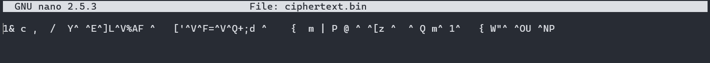

# Lab #2,Bui Nguyen An Khang,INSE33030E_03FIE
## Task 1: Firewall Configuration 

### Question 1: 
Setup a set of VMs/containers in a network configuration of 2 subnets (1,2) with a router forwarding traffic between them. Relevant services are also required:
- The router initially cannot route traffic between subnets
- PC0 on subnet 1 serves as a web server on subnet 1
- PC1, PC2 on subnet 2 act as client workstations on subnet 2 

### Answer 1:
1. **Create the network configuration:**
   - first - set up networks. Using Docker 
   ```bash
  
   docker network create --subnet=192.168.1.0/24 subnet1
   docker network create --subnet=192.168.2.0/24 subnet2
   ```

2. **Create and configure the router:**
   - Time to make our router.

   Privileged mode because we need the permissions

    Using Alpine because it's lightweight 
   ```bash 
   docker run -d --name router --privileged --net subnet1 --ip 192.168.1.1 alpine sh -c "apk add iptables && sleep infinity"
   # Connect to second subnet - router's gotta have multiple interfaces
   docker network connect --ip 192.168.2.1 subnet2 router
   ```

3. **Create and configure the web server (PC0):**
    Simple Nginx server
   ```bash
   docker run -d --name pc0 --net subnet1 --ip 192.168.1.2 nginx
   ```

4. **Create and configure the client workstations (PC1, PC2):**
   ```bash
   # Clients with SSH 
   docker run -d --name pc1 --net subnet2 --ip 192.168.2.2 alpine sh -c "apk add openssh && sleep infinity"
   docker run -d --name pc2 --net subnet2 --ip 192.168.2.3 alpine sh -c "apk add openssh && sleep infinity"
   ```

**Question 2**:
- Enable packet forwarding on the router.
- Deface the web server's home page with SSH connection on PC1

**Answer 2**:
1. **Enable packet forwarding on the router:**
   ```bash
   # Turning on IP forwarding 
   docker exec router sh -c "echo 1 > /proc/sys/net/ipv4/ip_forward"
   ```

2. **Deface the web server's home page from PC1:**
   - SSH hack time. 
   ```bash
   docker exec -it pc1 sh
   ssh root@192.168.1.2
   echo "Hacked by PC1" > /usr/share/nginx/html/index.html
   ```

**Question 3**:
Config the router to block SSH to the web server from PC1, leaving SSH/web access normally for all other hosts from subnet 1.

**Answer 3**:
1. **Block SSH from PC1 to the web server:**
   ```bash
   # Blocking SSH 
   docker exec router iptables -A FORWARD -s 192.168.2.2 -d 192.168.1.2 -p tcp --dport 22 -j DROP
   ```

**Question 4**:
- PC1 now serves as a UDP server, make sure that it can reply to UDP ping from other hosts on both subnets.
- Config personal firewall on PC1 to block UDP accesses from PC2 while leaving UDP access from the server intact.

**Answer 4**:
1. **Set up PC1 as a UDP server:**
   ```bash
   # UDP server setup 
   docker exec -it pc1 sh
   nc -u -l -p 12345
   ```

2. **Configure the personal firewall on PC1 to block UDP access from PC2:**
   ```bash
   # Selective UDP blocking 
   docker exec pc1 iptables -A INPUT -s 192.168.2.3 -p udp -j DROP
   ```
## Task 2:Encrypting Large Message
### Question 1:
### Encrypt the file with aes-cipher in CTR and OFB modes. How do you evaluate both cipher in terms of error propagation and adjacent plaintext blocks are concerned.
I will use seed@fb0d4aeef418 as PC2

First, we need to create a text file on PC2 that is at least 56 bytes long.

Now, we will create a python encypt file

With this code

Now we will encrypt the txt file we created


Next we will send the encrypt file to another pc


#### Error Propagation Evaluation  

CTR Mode: Errors in the ciphertext affect only the corresponding block of plaintext upon decryption. If a single bit is flipped in the ciphertext, only one block will be corrupted.
OFB Mode: Similar to CTR, errors in the ciphertext affect only the corresponding block of plaintext. However, since the keystream is generated independently of the plaintext, the error does not propagate to subsequent blocks.
#### HMac
We will also need to send a HMAC file to check for the integrity

### Question 2
To simulate corruption, we will need to modify the 6th bit of the ciphertext files before sending or we could alter nate the ciphertext file

Now we will need to create a py file with this code

So after receiving the files, verify the HMACs to check for integrity. If the HMAC does not match, the file is considered tampered with.
